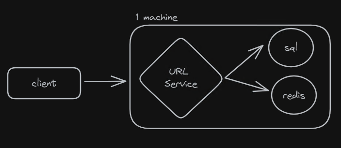

**System design - Tiny Url**

**1. Requirements**

**- functional**
 - The system should be able to generate a short url for a given long url.
 - The system should redirect to the original long url when the short url is accessed.

**- non functional**
 - low latency redirections
 - fault tolerant
 - high availability

**2. Logical Components**
  - url service

**3. Design**

**4. API**
 - POST /shorten
   - Request
	 - long url
   - Response
	 - short url
 - GET /{short url}
   - Response
	 - 301 redirect to long url